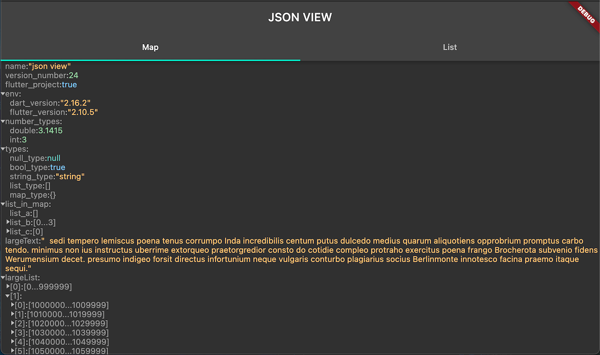

# json_view

A json preview package that has a not bad performance. 
lazy load json tree node that cause less jank. 
Support display large list json data like chrome dev tool.



## Highlight

* 👑 json type highlight.
* 📦 lazy load large list & map. 
* 🚀 not bad performance.

## Usage

* simple usage

```dart
JsonView(json: data)
```

* customize style

```dart
JsonConfig(
    /// your customize color scheme
    color: JsonColorScheme(...),
    /// any widget will contain jsonView
    child: ...,
)
```

## API reference

[pub.dev/documentation](https://pub.dev/documentation/json_view/latest/)


## Some thing went wrong 🤔

[create a new issue](https://github.com/laiiihz/json_view/issues/new)
& welcome [create a pull request](https://github.com/laiiihz/json_view/compare) 